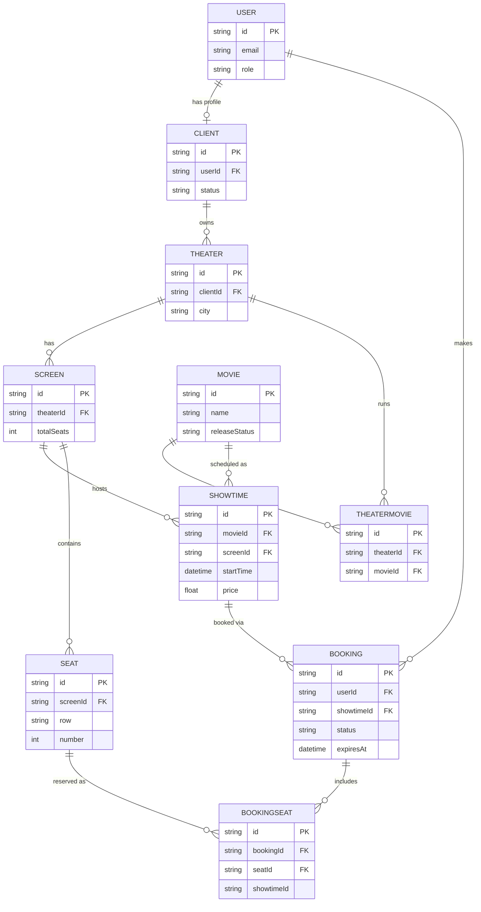

# Reservit — Database Schema Reference

## Entity Relationship Diagram

## Build status

| Model | Schema | CRUD API |
|---|---|---|
| User | ✅ | Auth only (register/login) |
| Client | ✅ | Register + approval flow pending |
| Movie | ✅ | ✅ done |
| Theater | ✅ | ✅ done |
| TheaterMovie | ✅ | ✅ done |
| Screen | ✅ | ⬜ not built |
| Showtime | ✅ | ⬜ not built (needs overlap check) |
| Seat | ⬜ not designed in schema yet | ⬜ |
| Booking / BookingSeat | ⬜ not designed in schema yet | ⬜ |

## How the entities connect

**Ownership chain**
`User` → optionally has a `Client` profile (this is what makes someone a theater owner, gated by `Client.status`: `PENDING` / `APPROVED` / `REJECTED`) → a `Client` owns many `Theater`s → each `Theater` owns many `Screen`s (the physical halls inside it).

This chain is the authorization backbone: every "can this user touch this resource" check ultimately walks back up to `Client.userId === req.user.userId`.

**Catalog side**
`Movie` is a standalone, admin-owned entity — independent of any theater until connected to one.

**Where catalog meets venue**
- `TheaterMovie` — join table meaning "this movie currently runs at this theater." No time, no price, just a flag-like relationship. Managed via explicit add/remove endpoints (not a raw array field) so it carries a real `id` and `addedAt` timestamp.
- `Showtime` — the actual bookable unit: "this movie, on this screen, starting at this time, at this price." Customers book against a `Showtime`, not a `Theater` or `Movie` directly.

**Not yet built — the booking core**
- `Seat` — belongs to `Screen` (the physical seat layout: row + number + type). Same seats exist regardless of which showtime is playing.
- `Booking` — one row per booking attempt, tied to a `User` and a `Showtime`, with a `status` (`PENDING`/`CONFIRMED`/`CANCELLED`/`EXPIRED`) and an `expiresAt` TTL for abandoned holds.
- `BookingSeat` — join table between `Booking` and `Seat`, carrying the single most important constraint in the whole schema: `@@unique([showtimeId, seatId])`. This guarantees at the database level that two users can never successfully book the same seat for the same showtime, even under a simultaneous race — Postgres rejects the second insert outright, independent of any application-level check.

## Key design decisions

- **`TheaterMovie` is an explicit join model, not Prisma's implicit many-to-many** — gives it a real `id` and `addedAt` timestamp, and supports clean CRUD-style admin operations instead of array-mutation.
- **`Showtime` uses `@@unique([screenId, startTime])`**, not single-field unique constraints — a screen can't host two showtimes starting at the exact same time, but the same movie/screen/time can otherwise repeat freely across the catalog.
- **Redis is not the source of truth for seat locking** — it's a UX optimization layer (fast "seat taken" feedback). The actual correctness guarantee lives in Postgres via the `BookingSeat` unique constraint, since Redis can fail, expire early, or be bypassed on retry, but a DB constraint cannot.
- **Ownership/ authorization is row-level, not just role-level** — a `CLIENT` role alone isn't sufficient to edit a `Theater`; the service layer must also confirm `theater.clientId` matches the requesting user's own `Client.id`.
